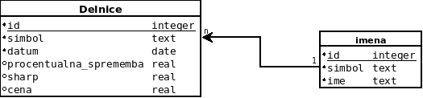

# Optimizacija-donosnosti-portfelja
Projekt pri OPB

## 1-podatki
	
#### 1-tabela_delnic.R

1. z `getwd()` preveri ali si v mapi `1-podatki`. Sicer spremeni working directory, kjer se nahaja `1-tabela_delnic.R`
2. Poženi program (v mapi se ustvari `podjetja_podatki.csv`)

#### 2-uvoz_podatkov.R 
		
1. z `getwd()` preveri ali si v mapi `1-podatki`. Sicer spremeni working directory, kjer se nahaja `2-uvoz_podatkov.R`
2. v tretji vrstici nastavi datum na željeni zaèetek. 

*Opozorilo: Sharpove vrednosti se za prvih 30 dni ne izraèuna*
3. poženi program (v mapi se ustvari `podatki_cen.csv`)

#### 3-generiranje_tabel.R 

1. z `getwd()` preveri ali si v mapi `1-podatki`. Sicer spremeni working directory, kjer se nahaja `3-generiranje_tabel.R`
2. Poženemo program. V mapi se ustvarijo `tabela1_cene.csv`, `tabela2_spremembe.csv`, `tabela3_sharpe.csv`

## 2-baza

**OPOZORILO**: v mapo prilepi `auth.template`, ki ga dobiš v mapi auth ter ga preimenuj v `auth.py`

V auth.py spremeni 
db: `seminarska_[username]`, host: `baza.fmf.uni-lj.si`, user = `[username]`, password = `[password]` in datoteko shrani
	
####	4-generiranje_baze_Postgresql.py

1. Poženi program. 

## 3-shiny

	

#### server.R
		
1. Poženi:
`library(shiny)`
`library(dplyr)`
`library(RPostgreSQL)`

2. V konzoli vpiši in izvedi ukaz: `runApp()`

##### V Shinyu lahko:

1. izberi datum, na katerega želiš izpisati Sharpove vrednosti. S kolešèkom nastavi, koliko delnic z najboljšimi Sharpovimi vrednosti v padajoèem vrstnem redu želiš prikazati.
2. Izberi dve razlièni delnici, ki jih želiš primerjati v izbranem èasovnem intervalu. 

*Opozorilo: datume lahko izbereš samo ob trgovalnih dnevih ter v obdobju, ki smo ga izbrali za prikaz gibanja cen delnic.*		

## ER diagram

